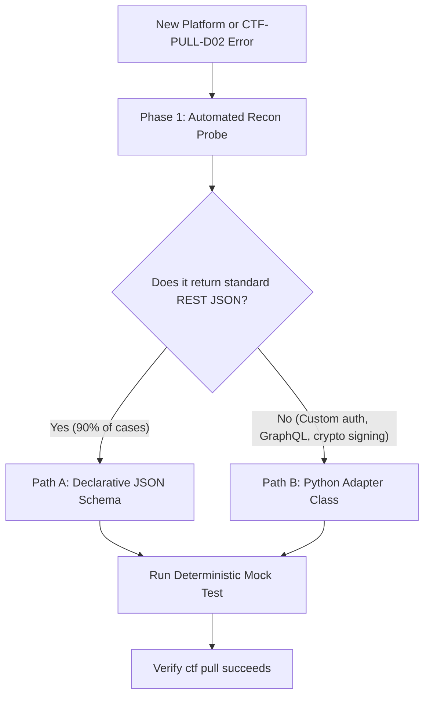

# CTF Platform Authoring & Scaffold Skill (`ctf-add-new-platform`)

Use this skill when adding support for a new CTF competition platform, updating an existing platform adapter, or diagnosing `CTF-PULL-D02` (unknown platform) incidents.

---

## ⚡ The Zero-Blind-Exploration Rule

**DO NOT read or explore the entire codebase blindly.** Adding a new CTF platform requires zero guesswork. Follow the prescriptive 2-Path Blueprint below.



---

## Phase 1: Automated Recon Probe

Before writing any configuration or code, run the built-in probe against the platform URL:

```bash
# 1. Run live automated reconnaissance
ctf platform probe -u <TARGET_URL> -c "<COOKIE>"

# Or save directly into workspace schema:
ctf platform probe -u <TARGET_URL> -c "<COOKIE>" --save --scope workspace
```

Note the output findings:
- **Title / Meta generator**: Will become `html_markers`.
- **Session cookie name**: Will become `cookie_hints`.
- **Challenge endpoint**: E.g. `/api/v1/challenges` or `/api/challenges`.
- **Array root**: E.g. `data.challenges` or `data` or `items`.
- **Field names**: Keys for `id`, `name`, `category`, `points`, `files`.

---

## Phase 2: Instant Scaffolding

Use the built-in scaffolding utility to generate the complete boilerplate and test file in 1 second:

### 🌟 Path A: Declarative JSON Schema (Recommended - 90% of cases)
*Zero Python code. Automatically loaded by `PlatformSchemaStore` and handled by `ConfigurablePlatform`.*

Run scaffold:
```bash
python3 scripts/scaffold_platform.py -k <key> -l "<Display Label>" -t json
```
This generates:
1. `ctf_downloader/platforms/definitions/<key>.json` (configured from template).
2. `tests/test_platform_<key>.py` (schema validation test).

**Step to finish Path A:**
Edit `ctf_downloader/platforms/definitions/<key>.json` to adjust endpoints and field mappings to match the recon findings.

---

### 🛠️ Path B: Dedicated Python Adapter (10% of cases)
*Use only when custom request signing, GraphQL, or special WebSocket challenge delivery is required.*

Run scaffold:
```bash
python3 scripts/scaffold_platform.py -k <key> -l "<Display Label>" -t python
```
This automatically:
1. Creates `ctf_downloader/platforms/<key>.py` with the standard `BasePlatform` boilerplate.
2. Registers `<key>` into `ctf_downloader/platforms/registry.py`.
3. Creates `tests/test_platform_<key>.py` with full `unittest.mock` lifecycle test.

**Steps to finish Path B:**
Implement the 4 mandatory methods in `ctf_downloader/platforms/<key>.py`:
1. `authenticate(self) -> bool`: Validate session via a lightweight GET.
2. `fetch_challenges(self) -> List[Challenge]`: Parse JSON into `Challenge` objects.
   - **Crucial**: Use `solved_by_me=...` (NOT `solved=...`).
   - **Crucial**: Use `self.base_url` (NOT `self.clean_base_url`).
3. `get_full_file_url(self, file_path: str) -> str`: Return absolute download URL.
4. `submit_flag(self, challenge_id, flag: str) -> Tuple[bool, str]`: POST flag to platform.

---

## Phase 3: Deterministic Unit Testing

Always run the generated unit test before retrying `ctf pull`:

```bash
pytest tests/test_platform_<key>.py
```

### Mocking Standard:
- **Use standard library**: `from unittest.mock import MagicMock`.
- **Do NOT import**: `requests_mock` (not installed in this environment).

---

## Phase 4: Common Pitfalls & Rules

| ❌ Anti-Pattern (Will Fail) | ✔️ Correct Standard |
|---|---|
| Reading dozens of files in `ctf_downloader/` to understand architecture | Run `python3 scripts/scaffold_platform.py` |
| Writing a 500-line Python adapter for a standard JSON API | Use Path A Declarative JSON schema |
| Using `self.clean_base_url` in adapter | Use `self.base_url` |
| Passing `solved=True` to `Challenge(...)` | Pass `solved_by_me=True` |
| Importing `requests_mock` in unit test | Import `from unittest.mock import MagicMock` |
| Hardcoding external URLs in test cases | Mock `session.get` and `session.post` locally |
